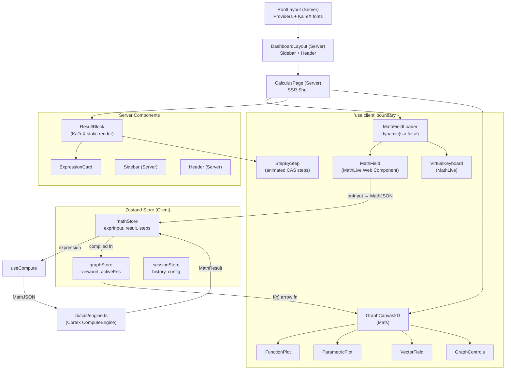
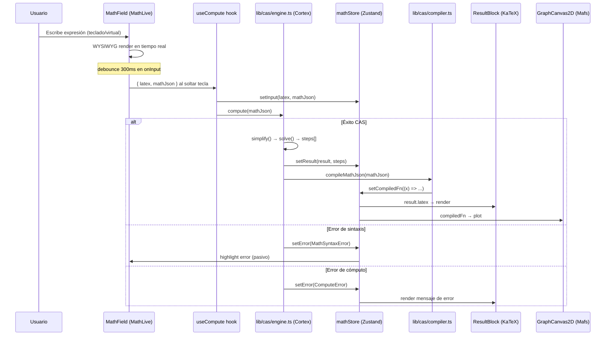

# 02_arquitectura_proyecto.md
# Arquitectura del Proyecto — Plataforma Matemática Web para Ingeniería

> **Guía arquitectónica canónica para Claude Code.**
> Stack: Next.js 14+ (App Router) · TypeScript · Cortex Compute Engine · MathLive · Mafs · MathBox · KaTeX · Zustand · localStorage

> ⚠️ DECISIÓN: Firebase eliminado del scope del MVP. El estado se maneja con Zustand (en memoria) y localStorage. Firebase se evaluará en una fase posterior al MVP.

---

## 1. ESTRUCTURA DE CARPETAS COMPLETA

math-platform/
├── app/ # Next.js 14 App Router (Server por defecto)
│ ├── layout.tsx # RootLayout — fuentes KaTeX preloaded, providers globales
│ ├── page.tsx # Landing/Home — Server Component estático
│ ├── (dashboard)/ # Route group — layout compartido sin prefijo URL
│ │ ├── layout.tsx # DashboardLayout — sidebar, header (Server)
│ │ ├── calculus/
│ │ │ └── page.tsx # Módulo Cálculo — SSR shell + Client boundary
│ │ ├── algebra/
│ │ │ └── page.tsx # Módulo Álgebra Lineal
│ │ ├── geometry/
│ │ │ └── page.tsx # Módulo Geometría Analítica + Graficadora 2D
│ │ └── fluids/
│ │ └── page.tsx # Módulo Fluidos/Hidráulica — Graficadora 3D
│ └── api/ # Next.js API Routes
│ ├── compute/
│ │ └── route.ts # POST /api/compute — CAS server-side pesado
│ └── export/
│ └── route.ts # POST /api/export — PDF/LaTeX generation
│
├── components/ # UI Components
│ ├── math-input/ # Módulo Input Matemático
│ │ ├── MathField.tsx # 'use client' — Wrapper MathLive <math-field>
│ │ ├── VirtualKeyboard.tsx # 'use client' — Teclado virtual MathLive
│ │ ├── MathFieldLoader.tsx # Dynamic import wrapper (ssr: false)
│ │ └── index.ts
│ ├── grapher/ # Módulo Graficadora 2D
│ │ ├── GraphCanvas2D.tsx # 'use client' — Mafs canvas principal
│ │ ├── GraphControls.tsx # 'use client' — controles viewport, zoom
│ │ ├── FunctionPlot.tsx # 'use client' — render de función individual
│ │ ├── ParametricPlot.tsx # 'use client' — curvas paramétricas
│ │ ├── VectorField.tsx # 'use client' — campos vectoriales 2D
│ │ └── index.ts
│ ├── grapher-3d/ # Módulo Graficadora 3D
│ │ ├── GraphCanvas3D.tsx # 'use client' — MathBox canvas 3D
│ │ ├── SurfacePlot.tsx # 'use client' — superficies z=f(x,y)
│ │ ├── VectorField3D.tsx # 'use client' — campos vectoriales 3D
│ │ └── index.ts
│ ├── results/ # Módulo Resultados
│ │ ├── ResultBlock.tsx # Server Component — KaTeX render estático
│ │ ├── StepByStep.tsx # 'use client' — animación pasos CAS
│ │ ├── ExpressionCard.tsx # Server Component — tarjeta resultado
│ │ └── index.ts
│ ├── layout/ # Componentes de layout
│ │ ├── Sidebar.tsx # Server Component
│ │ ├── Header.tsx # Server Component
│ │ ├── MobileDrawer.tsx # 'use client' — drawer responsivo
│ │ └── ThemeToggle.tsx # 'use client' — dark/light mode
│ └── ui/ # Primitivos UI (shadcn/ui style)
│ ├── Button.tsx
│ ├── Card.tsx
│ ├── Tabs.tsx # 'use client'
│ └── Tooltip.tsx # 'use client'
│
├── lib/ # Lógica de negocio pura (no UI)
│ ├── cas/ # Motor CAS — Cortex Compute Engine
│ │ ├── engine.ts # Singleton ComputeEngine + configuración
│ │ ├── parser.ts # MathJSON ↔ LaTeX ↔ JS function bridge
│ │ ├── simplify.ts # Simplificación simbólica + paso a paso
│ │ ├── solve.ts # Resolución de ecuaciones/sistemas
│ │ ├── calculus.ts # Derivadas, integrales, límites
│ │ ├── linear-algebra.ts # Matrices, determinantes, eigenvalores
│ │ └── compiler.ts # MathJSON → JS Arrow Function (para Mafs)
│ ├── math/ # Utilidades matemáticas puras
│ │ ├── interval-arithmetic.ts # Aritmética de intervalos para graficadora
│ │ ├── sampling.ts # Algoritmo subdivisión recursiva (Mafs-style)
│ │ ├── units.ts # Conversión de unidades (ingeniería)
│ │ └── constants.ts # Constantes matemáticas/físicas tipadas
│ └── utils/ # Utilidades generales
│ ├── debounce.ts # debounce/throttle tipado
│ ├── memoize.ts # Memoización de cálculos CAS
│ ├── latex.ts # Helpers LaTeX → display string
│ └── errors.ts # Tipos de error del flujo matemático
│
├── hooks/ # React Hooks personalizados
│ ├── useMathField.ts # Gestión estado MathLive + eventos
│ ├── useCompute.ts # Trigger CAS + loading/error state
│ ├── useGrapher.ts # Estado viewport 2D + funciones activas
│ ├── useGrapher3D.ts # Estado cámara 3D + superficies activas
│ ├── useHistory.ts # Historial de sesión (Zustand selector)
│ ├── useDebounce.ts # Debounce genérico para inputs
│
├── store/ # Estado global — Zustand
│ ├── mathStore.ts # Store principal: expresiones, resultados
│ ├── graphStore.ts # Store graficadora: viewport, funciones
│ ├── sessionStore.ts # Sesión activa: historial, configuración
│ └── index.ts # Re-exports centralizados
│
├── types/ # TypeScript types globales
│ ├── math.ts # MathExpression, MathResult, MathStep
│ ├── graph.ts # GraphFunction, Viewport2D, Surface3D
│ ├── session.ts # Session, HistoryEntry, UserConfig
│ └── mathlive.d.ts # Declaraciones JSX para <math-field>
│
├── public/
│ ├── fonts/ # KaTeX fonts (preload)
│ └── workers/
│ └── cas.worker.ts # Web Worker para CAS pesado
│
├── middleware.ts # Next.js middleware (auth guard futuro)
├── next.config.ts # Config: webpack workers, transpile packages
├── tailwind.config.ts # Tema extendido: colores math, variables CSS
└── tsconfig.json # Paths aliases: @/components, @/lib, etc.
text

---

## 2. ARQUITECTURA DE COMPONENTES

### Jerarquía de Componentes (Mermaid)



### Tabla Server vs. Client Components

| Componente | Tipo | Razón |
|---|---|---|
| `app/layout.tsx` | **Server** | Preload fonts, providers estáticos |
| `app/(dashboard)/layout.tsx` | **Server** | Sidebar/Header son estáticos |
| `ResultBlock.tsx` | **Server** | KaTeX render síncrono, sin interactividad |
| `ExpressionCard.tsx` | **Server** | Solo display, no state |
| `MathField.tsx` | **`'use client'`** | MathLive manipula DOM/Shadow DOM |
| `VirtualKeyboard.tsx` | **`'use client'`** | Eventos táctiles, DOM directo |
| `GraphCanvas2D.tsx` | **`'use client'`** | Mafs usa SVG interactivo con hooks React |
| `GraphCanvas3D.tsx` | **`'use client'`** | MathBox usa WebGL/Three.js |
| `StepByStep.tsx` | **`'use client'`** | Animaciones CSS + useState pasos |
| `GraphControls.tsx` | **`'use client'`** | Interacción zoom/pan |
| `ThemeToggle.tsx` | **`'use client'`** | localStorage + classList |

---

## 3. GESTIÓN DE ESTADO

### Arquitectura Zustand — 3 Stores Atómicas

```typescript
// store/mathStore.ts
import { create } from 'zustand'
import type { MathExpression, MathResult, MathStep } from '@/types/math'

interface MathStore {
  // Input
  rawLatex: string                    // LaTeX crudo de MathLive
  mathJson: MathExpression | null     // MathJSON parseado (Cortex)
  
  // Procesamiento
  isComputing: boolean
  error: MathError | null
  
  // Output
  result: MathResult | null
  steps: MathStep[]
  compiledFn: ((x: number) => number) | null  // Para Mafs
  
  // Actions
  setInput: (latex: string, json: MathExpression) => void
  setResult: (result: MathResult, steps: MathStep[]) => void
  setCompiledFn: (fn: (x: number) => number) => void
  setError: (error: MathError) => void
  reset: () => void
}

export const useMathStore = create<MathStore>((set) => ({
  rawLatex: '',
  mathJson: null,
  isComputing: false,
  error: null,
  result: null,
  steps: [],
  compiledFn: null,
  setInput: (latex, json) => set({ rawLatex: latex, mathJson: json, error: null }),
  setResult: (result, steps) => set({ result, steps, isComputing: false }),
  setCompiledFn: (fn) => set({ compiledFn: fn }),
  setError: (error) => set({ error, isComputing: false }),
  reset: () => set({ rawLatex: '', mathJson: null, result: null, steps: [], compiledFn: null }),
}))
```

```typescript
// store/graphStore.ts
interface GraphStore {
  viewport: Viewport2D              // { xMin, xMax, yMin, yMax }
  activeFunctions: GraphFunction[]  // Lista de f(x) activas en el canvas
  is3DMode: boolean
  activeSurfaces: Surface3D[]       // Para MathBox
  
  addFunction: (fn: GraphFunction) => void
  removeFunction: (id: string) => void
  setViewport: (vp: Viewport2D) => void
  toggle3D: () => void
}
```

```typescript
// store/sessionStore.ts
interface SessionStore {
  history: HistoryEntry[]     // Expresiones + resultados previos
  config: UserConfig          // Tema, notación, precision
  sessionId: string           // UUID de sesión
  
  addToHistory: (entry: HistoryEntry) => void
  clearHistory: () => void
  updateConfig: (config: Partial<UserConfig>) => void
}
```

### Qué va en estado local vs. global

| Estado | Dónde | Motivo |
|---|---|---|
| Valor del `<math-field>` en tiempo real | `useState` local en `MathField.tsx` | Solo afecta ese componente hasta submit |
| Expresión confirmada + MathJSON | **Zustand** `mathStore` | Lo consumen CAS, grapher, historial |
| Viewport del canvas (zoom/pan) | **Zustand** `graphStore` | GraphControls y GraphCanvas deben sincronizarse |
| Estado del teclado virtual (tab activo) | `useState` local en `VirtualKeyboard` | No se necesita fuera del componente |
| Historial de sesión | **Zustand** `sessionStore` | Persiste en localStorage, visible en sidebar |
| Loading state de animación CAS | `useState` local en `StepByStep` | Animación interna |

---

## 4. FLUJO DE DATOS PRINCIPAL

### Diagrama de Flujo Completo



### Implementación del Debounce + Hook Principal

```typescript
// hooks/useCompute.ts
import { useCallback, useEffect } from 'react'
import { useDebouncedCallback } from 'use-debounce'
import { useMathStore } from '@/store/mathStore'
import { useGraphStore } from '@/store/graphStore'
import { computeExpression } from '@/lib/cas/engine'
import { compileToFunction } from '@/lib/cas/compiler'
import type { MathExpression } from '@/types/math'

export function useCompute() {
  const { mathJson, setResult, setError, setCompiledFn } = useMathStore()
  const { addFunction } = useGraphStore()

  const runCompute = useCallback(async (expr: MathExpression) => {
    try {
      // 1. CAS: simplificar + resolver
      const { result, steps } = await computeExpression(expr)
      setResult(result, steps)

      // 2. Compilar a función JS para Mafs
      const fn = compileToFunction(expr)
      if (fn) {
        setCompiledFn(fn)
        addFunction({ id: crypto.randomUUID(), fn, latex: result.latex, color: '#3b82f6' })
      }
    } catch (err) {
      setError(err instanceof MathError ? err : new MathError('UNKNOWN', String(err)))
    }
  }, [setResult, setError, setCompiledFn, addFunction])

  // Debounce 300ms para no saturar el CAS mientras el usuario escribe
  const debouncedCompute = useDebouncedCallback(runCompute, 300)

  useEffect(() => {
    if (mathJson) debouncedCompute(mathJson)
  }, [mathJson, debouncedCompute])
}
```

### Bridge MathJSON → Función JS (crítico para Mafs)

```typescript
// lib/cas/compiler.ts
import { ComputeEngine } from '@cortex-js/compute-engine'

const ce = new ComputeEngine()

/**
 * Compila una expresión MathJSON a una arrow function JS evaluable por Mafs.
 * Cortex .compile() genera código JIT optimizado sobre bigint nativo.
 */
export function compileToFunction(
  expr: MathExpression
): ((x: number) => number) | null {
  try {
    const mexpr = ce.parse(expr.latex) // MathJSON → BoxedExpression
    const compiled = mexpr.compile()    // JIT compile
    return (x: number) => compiled({ x }) as number
  } catch {
    return null // Expresión no graficable (ej: ecuación, no función)
  }
}
```

---

## 5. API ROUTES (Next.js)

### Decisión: Client-side vs. Server-side vs. Server Actions

| Lógica | Dónde | Razón |
|---|---|---|
| Cálculo CAS simple (< 50ms) | Client-side (Cortex en browser) | Latencia cero, sin red |
| Cálculo CAS pesado (matrices grandes, integrales múltiples) | `POST /api/compute` | Evita bloqueo del main thread |
| Guardar/cargar historial | **Zustand + localStorage** | Sin servidor — estado en memoria y localStorage |
| Exportar PDF/LaTeX | `POST /api/export` | Requiere librerías Node.js (puppeteer/pdfkit) |

### Estructura de Endpoints

```typescript
// app/api/compute/route.ts
import { NextRequest, NextResponse } from 'next/server'
import { computeHeavy } from '@/lib/cas/engine'

export async function POST(req: NextRequest) {
  const { mathJson, operation } = await req.json()
  
  // Validación de entrada
  if (!mathJson || !operation) {
    return NextResponse.json({ error: 'Missing params' }, { status: 400 })
  }
  
  try {
    const result = await computeHeavy(mathJson, operation)
    return NextResponse.json({ result }, { status: 200 })
  } catch (err) {
    return NextResponse.json({ error: (err as Error).message }, { status: 422 })
  }
}
```

> ⚠️ DECISIÓN: Firebase eliminado del scope del MVP. El estado se maneja con Zustand (en memoria) y localStorage. Firebase se evaluará en una fase posterior al MVP.

El historial de cálculos se guarda en `sessionStore` (Zustand) y se persiste en `localStorage`. No hay Server Actions ni endpoints de historial.

---

## 6. PERSISTENCIA (MVP — Sin Firebase)

> ⚠️ DECISIÓN: Firebase eliminado del scope del MVP. El estado se maneja con Zustand (en memoria) y localStorage. Firebase se evaluará en una fase posterior al MVP.

### Estrategia de Persistencia MVP

| Dato | Dónde | Duración |
|---|---|---|
| Expresión actual + resultado | Zustand `mathStore` | Solo en sesión |
| Funciones activas en graficadora | Zustand `graphStore` | Solo en sesión |
| Historial de cálculos | Zustand `sessionStore` + `localStorage` | Entre recargas |
| Configuración de usuario (tema, precisión) | `localStorage` | Permanente |

El `sessionStore` usa el middleware `persist` de Zustand para sincronizar automáticamente con `localStorage`.

---

## 7. CONVENCIONES DE CÓDIGO

### Naming Conventions

| Elemento | Convención | Ejemplo |
|---|---|---|
| Componentes React | `PascalCase` | `GraphCanvas2D.tsx` |
| Hooks | `camelCase` con prefijo `use` | `useCompute.ts` |
| Stores Zustand | `camelCase` + `Store` suffix | `mathStore.ts` |
| Utilidades puras | `camelCase` | `debounce.ts`, `memoize.ts` |
| Types/Interfaces | `PascalCase` | `MathExpression`, `GraphFunction` |
| Archivos de tipos | `camelCase` en `/types/` | `math.ts`, `graph.ts` |
| API Routes | carpetas `kebab-case` | `app/api/compute/route.ts` |
| Constantes | `SCREAMING_SNAKE_CASE` | `MAX_STEP_DEPTH = 20` |

### Estructura de un Componente Tipo (`'use client'`)

```typescript
// components/grapher/FunctionPlot.tsx
'use client'

import { memo } from 'react'
import { Plot } from 'mafs'
import type { GraphFunction } from '@/types/graph'

// ─── Types ───────────────────────────────────────────────────────────────────
interface FunctionPlotProps {
  fn: GraphFunction
  domain?: [number, number]
}

// ─── Component ───────────────────────────────────────────────────────────────
/**
 * Renderiza una función matemática f(x) usando Mafs.
 * Usa subdivisión recursiva para funciones con discontinuidades.
 */
export const FunctionPlot = memo(function FunctionPlot({
  fn,
  domain = [-10, 10],
}: FunctionPlotProps) {
  return (
    <Plot.OfX
      y={fn.compiledFn}
      color={fn.color}
      minSamplingDepth={4}
      maxSamplingDepth={10}
      domain={domain}
    />
  )
})

FunctionPlot.displayName = 'FunctionPlot'
```

### TypeScript Types para Expresiones Matemáticas

```typescript
// types/math.ts
import type { MathJson } from '@cortex-js/compute-engine'

// Expresión tal como la entrega MathLive → Cortex
export type MathExpression = {
  latex: string       // Fuente de verdad legible
  mathJson: MathJson  // Representación simbólica estructurada
}

// Resultado procesado por Cortex CAS
export type MathResult = {
  latex: string                         // Para KaTeX
  numericValue?: number | Complex       // Si evaluable numéricamente
  domain?: 'Real' | 'Complex' | 'Integer'
  isFunction: boolean                   // ¿Se puede graficar?
}

// Un paso individual del proceso CAS (para StepByStep)
export type MathStep = {
  id: string
  latex: string           // Expresión en este paso
  justification: string   // Ej: "Factorizar término común"
  rule: CASRule           // Enum de reglas algebraicas aplicadas
}

// Función lista para Mafs
export type GraphFunction = {
  id: string
  latex: string
  compiledFn: (x: number) => number
  color: string
  visible: boolean
  domain?: [number, number]
}

// Viewport del canvas 2D
export type Viewport2D = {
  xMin: number
  xMax: number
  yMin: number
  yMax: number
}
```

---

## 8. PERFORMANCE PATTERNS

### Lazy Loading de Módulos Matemáticos Pesados

```typescript
// components/math-input/MathFieldLoader.tsx
'use client'
import dynamic from 'next/dynamic'
import { Suspense } from 'react'

// MathLive usa Shadow DOM y Web Components — NUNCA se puede SSR
const MathField = dynamic(
  () => import('./MathField').then(m => m.MathField),
  {
    ssr: false,
    loading: () => (
      <div className="h-14 w-full animate-pulse rounded-md bg-muted" />
    ),
  }
)

// MathBox/Three.js — carga diferida hasta que el usuario activa vista 3D
export const GraphCanvas3D = dynamic(
  () => import('@/components/grapher-3d/GraphCanvas3D'),
  {
    ssr: false,
    loading: () => <div className="h-96 w-full bg-background flex items-center justify-center">
      <span className="text-muted-foreground text-sm">Cargando visualizador 3D...</span>
    </div>,
  }
)
```

### Memoización de Cálculos CAS Costosos

```typescript
// lib/utils/memoize.ts
import { LRUCache } from 'lru-cache'
import type { MathExpression, MathResult } from '@/types/math'

// Cache LRU: máximo 100 resultados, TTL 10 minutos
const casCache = new LRUCache<string, { result: MathResult; steps: MathStep[] }>({
  max: 100,
  ttl: 1000 * 60 * 10,
})

export function memoizedCompute(
  fn: (expr: MathExpression) => Promise<{ result: MathResult; steps: MathStep[] }>
) {
  return async (expr: MathExpression) => {
    // Key basada en el LaTeX normalizado
    const cacheKey = expr.latex.trim().replace(/\s+/g, '')
    
    if (casCache.has(cacheKey)) {
      return casCache.get(cacheKey)!
    }
    
    const computed = await fn(expr)
    casCache.set(cacheKey, computed)
    return computed
  }
}

// lib/cas/engine.ts — uso del memoize
export const computeExpression = memoizedCompute(async (expr) => {
  const ce = getComputeEngine() // singleton
  const boxed = ce.parse(expr.latex)
  const simplified = boxed.simplify()
  // ... extraer pasos ...
  return { result, steps }
})
```

### Optimización de Re-renders en la Graficadora

```typescript
// hooks/useGrapher.ts — Subscripción selectiva Zustand (evita re-renders globales)
import { useShallow } from 'zustand/react/shallow'
import { useGraphStore } from '@/store/graphStore'

export function useGrapher() {
  // Solo re-renderiza cuando cambien EXACTAMENTE activeFunctions o viewport
  // No re-renderiza si cambia config u otras slices del store
  const { activeFunctions, viewport } = useGraphStore(
    useShallow((s) => ({
      activeFunctions: s.activeFunctions,
      viewport: s.viewport,
    }))
  )
  return { activeFunctions, viewport }
}

// components/grapher/GraphCanvas2D.tsx — Memoización del canvas completo
export const GraphCanvas2D = memo(function GraphCanvas2D() {
  const { activeFunctions, viewport } = useGrapher()
  
  return (
    <Mafs
      viewBox={{ x: [viewport.xMin, viewport.xMax], y: [viewport.yMin, viewport.yMax] }}
      preserveAspectRatio={false}
    >
      <Coordinates.Cartesian />
      {activeFunctions.map(fn => (
        <FunctionPlot key={fn.id} fn={fn} />
      ))}
    </Mafs>
  )
})
```

### Web Worker para CAS Pesado (Futuro)

```typescript
// public/workers/cas.worker.ts
import { ComputeEngine } from '@cortex-js/compute-engine'

const ce = new ComputeEngine()

self.onmessage = async (e: MessageEvent<{ id: string; latex: string; op: string }>) => {
  const { id, latex, op } = e.data
  try {
    const expr = ce.parse(latex)
    let result
    if (op === 'integrate') result = expr.integrate('x')
    if (op === 'solve') result = expr.solve('x')
    // ...
    self.postMessage({ id, result: result?.latex, success: true })
  } catch (err) {
    self.postMessage({ id, error: String(err), success: false })
  }
}

// hooks/useCASWorker.ts — comunicación tipada con el worker
export function useCASWorker() {
  const workerRef = useRef<Worker>()
  
  useEffect(() => {
    workerRef.current = new Worker('/workers/cas.worker.js')
    return () => workerRef.current?.terminate()
  }, [])
  
  const compute = useCallback((latex: string, op: string) => {
    return new Promise<string>((resolve, reject) => {
      const id = crypto.randomUUID()
      workerRef.current!.postMessage({ id, latex, op })
      workerRef.current!.onmessage = (e) => {
        if (e.data.id === id) {
          e.data.success ? resolve(e.data.result) : reject(e.data.error)
        }
      }
    })
  }, [])
  
  return { compute }
}
```

---

## Checklist de Arranque del Proyecto

```bash
# 1. Crear proyecto Next.js 14+ con TypeScript
npx create-next-app@latest math-platform --typescript --tailwind --app --src-dir=false

# 2. Instalar dependencias del stack matemático
npm install @cortex-js/compute-engine mathlive mafs mathbox-react
npm install zustand lru-cache use-debounce

# 3. Instalar KaTeX
npm install katex react-katex
npm install -D @types/katex

# 5. Crear estructura de carpetas
mkdir -p components/{math-input,grapher,grapher-3d,results,layout,ui}
mkdir -p lib/{cas,math,utils}
mkdir -p {hooks,store,types,public/workers}
```

> **Nota crítica para Claude Code:** Los componentes `MathField`, `GraphCanvas2D` y `GraphCanvas3D` **siempre** deben importarse con `dynamic(..., { ssr: false })` para evitar hydration mismatch. El bridge `compiler.ts` es la capa de traducción obligatoria entre el mundo simbólico (MathJSON/Cortex) y el mundo funcional (JavaScript/Mafs). Nunca pasar LaTeX crudo directamente a Mafs.

